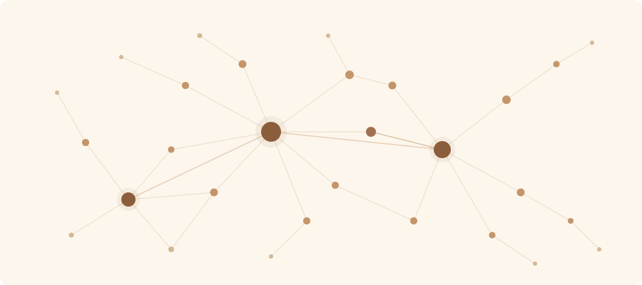

# LLM-Kasten: Agentic Knowledge Management



A CLI that turns markdown files into a searchable, interlinked knowledge base. Built for LLM coding agents. Every command outputs JSON.

## The problem

AI coding agents (Claude Code, Codex, Cursor, Gemini CLI) are powerful but amnesiac. Every session starts fresh. CLAUDE.md and AGENTS.md help, but they cap out at ~60 useful lines. When your project knowledge grows beyond that -- architecture decisions, API contracts, research notes, domain rules -- agents start hallucinating what they can't remember.

## What kasten does

kasten gives agents a searchable knowledge base they can query on demand, instead of cramming everything into a flat config file. Notes are plain markdown with YAML frontmatter. kasten indexes them with SQLite FTS5, tracks `[[wiki-links]]` with backlinks, and outputs structured JSON from every command.

```bash
pip install llm-kasten
kasten init .
kasten note new "Auth Architecture" --tag auth --body-file /tmp/auth.md --summary "JWT with RS256"
kasten search "authentication" -j    # Agent gets structured results with full bodies
```

The agent searches what it needs, when it needs it. No context window bloat.

## How agents use it

kasten auto-injects a usage guide into your CLAUDE.md (and AGENTS.md, GEMINI.md, copilot-instructions.md) at `kasten init`. From then on, any agent working in the repo knows these commands exist.

A typical agent workflow:

```bash
# Agent needs context on auth -- searches the knowledge base
kasten search "auth" -j
# Returns: [{id, title, tags, summary, body, score}, ...]

# Agent reads specific notes it found
kasten note show auth-architecture session-management -j

# Agent writes new knowledge after completing a task
echo "# API Rate Limiting\n\n..." > /tmp/rate-limits.md
kasten note new "API Rate Limiting" --tag api --tag security \
  --body-file /tmp/rate-limits.md --summary "Token bucket with Redis" -j

# Agent updates metadata
kasten note update auth-architecture --status evergreen --add-tag reviewed -j

# Agent checks vault health
kasten lint -j
```

Every command returns consistent JSON:

```json
{
  "ok": true,
  "data": { ... },
  "count": 42,
  "vault": "/path/to/repo",
  "timestamp": "2026-04-06T00:00:00+00:00"
}
```

## What's in a vault

```
your-repo/
  .kasten/             # Hidden: config, SQLite index, templates
  knowledge/
    notes/             # Markdown notes (the source of truth)
    index/             # Auto-generated wiki pages
  CLAUDE.md            # Agent docs (auto-injected)
```

Markdown files are the source of truth. The SQLite database is a derived cache, rebuilt anytime with `kasten sync --force`. Files outlast tools.

## Note format

```yaml
---
title: "Auth Architecture"
id: "auth-architecture"
tags: [auth, security, jwt]
status: "evergreen"
summary: "JWT auth with RS256 and refresh token rotation"
---

# Auth Architecture

Content here. Link to other notes with [[session-management]] or [[jwt-tokens|JWT]].
```

kasten tracks `[[wiki-links]]` automatically -- backlinks, broken links, orphan notes, hub notes ranked by inbound link count.

## Status lifecycle

```
draft --> review --> evergreen --> stale --> deprecated --> archive
```

`kasten repair` auto-promotes qualifying notes and auto-fills missing tags and summaries.

## Commands

```bash
# Search
kasten search "query" -j                         # FTS5 + BM25, returns bodies in JSON
kasten search "query" --tag ml --status evergreen -j

# Read
kasten note show <id> -j                         # One note
kasten note show <id1> <id2> <id3> -j            # Multiple at once

# Create
kasten note new "Title" --tag t --body-file f.md --summary "..." -j

# Update
kasten note update <id> --status evergreen --add-tag ml -j

# Knowledge graph
kasten graph backlinks <id> -j                   # What links here
kasten graph hubs -j                             # Most-linked notes
kasten graph broken -j                           # Broken links
kasten graph stub -j                             # Auto-create stubs for broken links

# Maintain
kasten status -j                                 # Vault health overview
kasten lint -j                                   # 11 health check rules
kasten repair -j                                 # Full rebuild + fix + promote + index
kasten tags -j                                   # All tags with counts

# Bulk
kasten batch tag-add ml --parent deep-learning -j
kasten batch set-status review --tag unreviewed -j

# Other
kasten index build                               # Rebuild wiki index pages
kasten dedup -j                                  # Find near-duplicates
kasten export json -j                            # Full JSON dump
kasten import ./other-kb -j                      # Import notes
kasten serve                                     # Web UI with knowledge graph
kasten watch                                     # Auto-sync on file changes
kasten git log -j                                # Notes changed in git
```

## Agent config files

`kasten init` auto-injects a usage guide into agent config files:

| Flag | File | Read by |
|------|------|---------|
| `--agents claude` (default) | `CLAUDE.md` | Claude Code |
| `--agents agents` | `AGENTS.md` | Cursor, Codex, Copilot, Windsurf, Amp, Devin |
| `--agents gemini` | `GEMINI.md` | Gemini CLI |
| `--agents copilot` | `.github/copilot-instructions.md` | GitHub Copilot |

Existing files get a marked section appended (idempotent). Update anytime with `kasten config agent-docs`.

## MCP server (optional)

For agents that can't shell out (Claude Desktop, Cursor inline):

```bash
pip install llm-kasten[mcp]
```

Add to `claude_desktop_config.json` or `.cursor/mcp.json`:

```json
{
  "mcpServers": {
    "kasten": {
      "command": "kasten",
      "args": ["mcp"]
    }
  }
}
```

8 read-only tools: `search_notes`, `read_note`, `read_many`, `list_notes`, `get_backlinks`, `get_hubs`, `vault_status`, `lint_vault`.

## Configuration

`.kasten/config.toml`:

```toml
[vault]
name = "My Research"
knowledge_dir = "knowledge"

[search]
boost_evergreen = 1.5
penalize_deprecated = 0.3
```

## Real-world usage

Built and tested on a 600+ note LLM research knowledge base (300K+ words, 2600+ wiki-links, 375 tags). Handles search in under 10ms, full vault sync in under 2 seconds.

## Contributing

See [CONTRIBUTING.md](CONTRIBUTING.md).

## License

[MIT](LICENSE)
